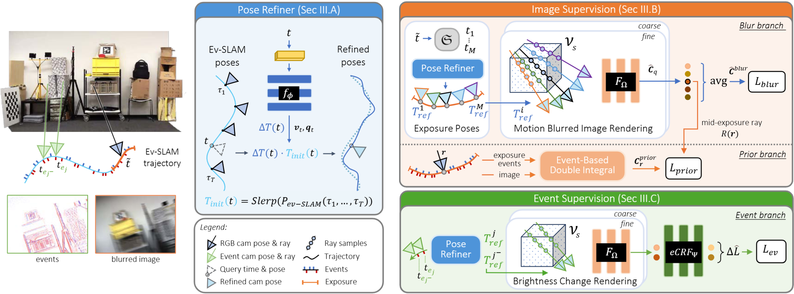

<p align="center">
    <h1 align="center"> Event-Aided Sharp Radiance Field Reconstruction for Fast-Flying Drones</h1>
</p>
<p align="center">
    Rong Zou<sup>&#10033;</sup>, Marco Cannici<sup>&#10033;</sup>, Davide Scaramuzza<br/>
    <sup>&#10033;</sup><i>Equal contribution</i><br/>
</p>
<p align="center">
    <i>Robotics and Perception Group, University of Zürich</i>
</p>
<p align="center"> 
    <strong>IEEE Transactions on Robotics (T-RO) 2026</strong>
</p>

<p align="center">
  <a href="https://www.ieee-ras.org/publications/t-ro/">
    
  </a>
  <a href="https://rpg.ifi.uzh.ch/docs/TRO26_Rong.pdf">
    
  </a>
  <a href="https://youtu.be/dVaH0VVXhQc">
    
  </a>
  <a href="https://pytorch.org/">
    
  </a>
  <a href="https://github.com/uzh-rpg/event-sharp-nerf-drones/blob/master/LICENSE">
    
  </a>
</p>
<p align="center">
  <a href="https://youtu.be/dVaH0VVXhQc">
    
  </a>
</p>

## Citation
If you use this codebase, or the datasets accompanying the paper, please cite the following publications:

```bibtex
@Article{Zou_2026_TRO,
  title     = {Event-Aided Sharp Radiance Field Reconstruction for Fast-Flying Drones},
  author    = {Rong Zou and Marco Cannici and Davide Scaramuzza},
  journal   = {IEEE Transactions on Robotics},
  publisher = {IEEE},
  year      = {2026},
}

@InProceedings{Cannici_2024_CVPR,
  title     = {Mitigating Motion Blur in Neural Radiance Fields with Events and Frames},
  author    = {Marco Cannici and Davide Scaramuzza},
  booktitle = {Proceedings of the IEEE/CVF Conference on Computer Vision and Pattern Recognition (CVPR)},
  year      = {2024},
}
```

## Abstract

Fast-flying aerial robots promise rapid inspection under limited battery constraints, with direct applications in 
infrastructure inspection, terrain exploration, and search and rescue. However, high speeds lead to severe motion 
blur in images and induce significant drift and noise in pose estimates, making dense 3D reconstruction with Neural
Radiance Fields (NeRFs) particularly challenging due to their high sensitivity to such degradations. 

In this work, we present a unified framework that leverages asynchronous event streams alongside motion‑blurred frames 
to reconstruct high‑fidelity radiance fields from agile drone flights. By embedding event‑image fusion into NeRF 
optimization and jointly refining event-based visual‑inertial odometry priors using both modalities, our method 
recovers sharp radiance fields and accurate camera trajectories without ground‑truth supervision. We validate our 
approach on both synthetic data and real‑world sequences captured by a fast‑flying drone. 
Despite highly dynamic drone flights, where RGB frames are severely degraded by motion blur and pose priors become 
unreliable, our method reconstructs high-fidelity radiance fields and preserves fine scene details, delivering over 
a 50% performance gain on real-world data relative to state-of-the-art methods.

## Method Overview



We propose a unified event-aided NeRF framework tailored to agile aerial robots operating at high speeds. The method 
tightly integrates asynchronous event streams and motion-blurred image frames directly into radiance field optimization, 
while simultaneously refining noisy pose priors obtained from event-based visual–inertial odometry.  This design enables 
sharp and geometrically consistent radiance field reconstruction even under aggressive drone maneuvers.

## Results


Our method consistently reconstructs sharp, high-fidelity radiance fields from fast drone flights where conventional 
NeRF pipelines fail due to motion blur and pose drift. We demonstrate strong improvements over state-of-the-art NeRF 
and event-based reconstruction methods on both synthetic benchmarks and real-world drone sequences.


## Project Overview

### 1. Install Conda Environment

We recommend using the [miniforge](https://github.com/conda-forge/miniforge#mambaforge) conda distribution to install 
dependencies using the provided `environment.yml` file.

```bash
mamba env create -f environment.yml
mamba activate event-sharp-nerf-drones
mamba install pytorch==1.13.1 torchvision==0.14.1 torchaudio==0.13.1 pytorch-cuda=11.6 -c pytorch -c nvidia
```

<details>
<summary> Dependencies (click to expand) </summary>

```
- python=3.8
- pytorch-cuda=11.6
- pytorch==1.13.1
- torchvision==0.14.1
- configargparse=1.5.3
- einops=0.7.0
- imageio=2.22.0
- kornia=0.6.9
- numba=0.56.4
- numpy=1.23.1
- pandas=2.0.3
- plotly=5.18.0
- scikit-image=0.19.2
- scipy=1.9.1
- tqdm=4.65.0
- h5py=3.8.0
- pillow=9.2.0
- pyyaml=6.0
- open3d=0.15.1
- imageio-ffmpeg>=0.4.9
- matplotlib>=3.7.3
- opencv-python==4.6.0.66
- tensorboardx>=2.5.1
- roma>=1.5.0
- evo>=1.30.0
- dill>=0.3.6
- wandb>=0.24.2
```    

</details>

### 2. Download Datasets

This work builds upon datasets introduced in our previous paper **Ev-DeblurNeRF** and additionally introduces new 
datasets and extensions tailored to fast-flying drone scenarios. Below we describe how to obtain all datasets required to reproduce the results reported in the paper.

### _Ev-DeblurNeRF Datasets_

Results reported in **Tables I and II** rely on the **Ev-DeblurNeRF-Blender** and **Ev-DeblurNeRF-CDAVIS** datasets 
we introduced in [*Mitigating Motion Blur in Neural Radiance Fields with Events and Frames* (CVPR 2024)](https://rpg.ifi.uzh.ch/docs/CVPR24_Cannici.pdf).

To reproduce these results, download the datasets from the links below and place them in a `datasets/` directory at the 
root of the repository<sup>*</sup>:
```
datasets/
├─ evdeblurnerf_cdavis/
├─ evdeblurnerf_blender/
```

| Dataset               | Description                                                                                                       | Size |
|-----------------------|-------------------------------------------------------------------------------------------------------------------|--|
| Ev-DeblurNeRF-CDAVIS  | [evdeblurnerf_cdavis.zip](https://download.ifi.uzh.ch/rpg/web/data/cvpr24_evdeblurnerf/evdeblurnerf_cdavis.zip)   | 187M |
| Ev-DeblurNeRF-Blender | [evdeblurnerf_blender.zip](https://download.ifi.uzh.ch/rpg/web/data/cvpr24_evdeblurnerf/evdeblurnerf_blender.zip) | 877M |

<sup>*</sup> You can save the datasets in a custom location, but make sure to update the `datadir` parameter in the 
config files accordingly.

Please refer to the original [Ev-DeblurNeRF repository](https://github.com/uzh-rpg/EvDeblurNeRF) for details on the
dataset structure and format.

### _NoisyPose Ev-DeblurNeRF-Blender Extension_

Results reported in **Tables III and IV** extend the Ev-DeblurNeRF-Blender dataset with **noisy camera trajectories**, 
simulating pose degradation. We provide these additional trajectory files in the following:

| Extension                                    | Description                                                                                                                               | Size | 
|----------------------------------------------|-------------------------------------------------------------------------------------------------------------------------------------------|------|
| Ev-DeblurNeRF-Blender NoisyPose Trajectories | [evdeblurnerf_blender_noisyposes.zip](https://download.ifi.uzh.ch/rpg/web/data/tro26_ev-deblur-drone/evdeblurnerf_blender_noisyposes.zip) | 3.1M |

Download the archive and extract its contents into the existing `datasets/evdeblurnerf_blender/` directory structure,
so that the new trajectory files are placed alongside the original ones in each recording subfolder.

After extraction, the folder structure should resemble the following:

<details>
<summary>Folder structure (click to expand)</summary>

```
datasets/
└─ evdeblurnerf_blender/
  ├─ blurfactory/
  │  ├─ all_poses_bounds.npy ◁── [original] All available poses in LLFF format
  │  ├─ all_timestamps.npy   ◁── [original] All available timestamps
  │  ├─ poses_bounds.npy     ◁── [original] Image poses in LLFF format
  │  ├─ all_rot0.2_tran0.02_poses_bounds.npy ◁── [*new* perturbed v1] All available poses in LLFF format
  │  ├─ rot0.2_tran0.02_poses_bounds.npy     ◁── [*new* perturbed v1] Image poses
  │  ├─ all_rot0.4_tran0.04_poses_bounds.npy ◁── [*new* perturbed v2] All available poses in LLFF format
  │  ├─ rot0.4_tran0.04_poses_bounds.npy     ◁── [*new* perturbed v2] Image poses
  │  ├─ all_rot0.8_tran0.08_poses_bounds.npy ◁── [*new* perturbed v3] All available poses in LLFF format
  │  ├─ rot0.8_tran0.08_poses_bounds.npy     ◁── [*new* perturbed v3] Image poses
  │  ├─ all_rot1.2_tran0.12_poses_bounds.npy ◁── [*new* perturbed v4] All available poses in LLFF format
  │  ├─ rot1.2_tran0.12_poses_bounds.npy     ◁── [*new* perturbed v4] Image poses in LLFF format
  │  └─ ... (remaining files unchanged)
  └─ ... 
```

</details>

### _Gen3-HandHeld and Gen3-DroneFlight Datasets_

We introduce **Gen3-HandHeld and Gen3-DroneFlight**, two real-world event-based datasets captured under fast and 
aggressive motion. Both datasets are recorded using a hardware-synchronized beamsplitter setup with a Prophesee Gen3 
event camera and an RGB camera observing the same scene. **Gen3-HandHeld** consists of fast handheld motions with
varying blur severity, while **Gen3-DroneFlight** features the same  sensing setup mounted on a quadrotor performing 
agile flight maneuvers.

The beamsplitter design is available in the following repository: [RPG Beamsplitter Design](https://github.com/uzh-rpg/eds-buildconf?tab=readme-ov-file#rpg-beamsplitter-design)

For each sequence, we provide three sets of camera poses: (1) pose estimates obtained with UltimateSLAM, used as priors 
during training, (2) motion-capture ground-truth poses, provided only for evaluation, (3) refined poses obtained by our 
NeRF optimization after training using UltimateSLAM's prior.

Download the datasets from the links below and place them in a `datasets/` directory at the root of the repository:
```
datasets/
├─ gen3_droneflight/
├─ gen3_handheld/
```

| Dataset          | Description                                                                                                 | Size  |
|------------------|-------------------------------------------------------------------------------------------------------------|-------|
| Gen3-HandHeld    | [gen3_handheld.zip](https://download.ifi.uzh.ch/rpg/web/data/tro26_ev-deblur-drone/gen3_handheld.zip)       | 3.9G  |
| Gen3-DroneFlight | [gen3_droneflight.zip](https://download.ifi.uzh.ch/rpg/web/data/tro26_ev-deblur-drone/gen3_droneflight.zip) | 12.7G |

These datasets follow the same format as the Ev-DeblurNeRF datasets, with RGB frames, events, and camera poses provided 
in LLFF format. Please refer to the original 
[LLFF codebase](https://github.com/Fyusion/LLFF?tab=readme-ov-file#using-your-own-poses-without-running-colmap) 
for a more detailed description of camera poses format. We provide a summary of the folder structure below:

<details>
<summary>Folder structure (click to expand)</summary>

```
datasets/
├─ gen3_droneflight/
│  ├─ boxstack/speed1/
│  │  ├─ images_1/            ◁── Undistorted blur and sharp images, see llffhold and llffhold_end args.
│  │  │  ├─ 00.png            ◁─┬ Blur images are from 00.png to {N-5}.png
│  │  │  ├─ ...png              └ The section of blur images is controlled by the llffhold and llffhold_end args.
│  │  │  ├─ {N-4}.png         ◁─┬ Sharp images are from {N-4}.png to {N}.png
│  │  │  ├─ ...png              │ With the `llffhold_end` argument we specify that the sharp images are provided at the
│  │  │  ├─ {N}.png             └ end of the sequence, while `llffhold` specifies how many sharp images are provided
│  │  │  └─ timestamps.npz
│  │  ├─ events.h5            ◁─┬ Events saved in HDF5 file format with (p, t, x, y) keys. 
│  │  │                         └ Timestamps are either in us or ns, see events_tms_unit arg.
│  │  ├─ K.yaml               ◁── Camera intrinsics after undistortion and rectification.
│  │  ├─ all_poses_bounds.npy ◁── [MoCap] All available poses in LLFF format
│  │  ├─ all_timestamps.npy   ◁── [MoCap] All available poses' timestamps
│  │  ├─ poses_bounds.npy     ◁── [MoCap] Image poses in LLFF format
│  │  ├─ all_uslam_poses_bounds.npy ◁── [USLAM] All available USLAM poses in LLFF format
│  │  ├─ all_uslam_timestamps.npy   ◁── [USLAM] All available USLAM poses' timestamps
│  │  ├─ uslam_poses_bounds.npy     ◁── [USLAM] Image USLAM poses in LLFF format
│  │  ├─ all_refined_poses_bounds.npy ◁── [Refined] All available poses in LLFF format refined by our NeRF optimization
│  │  └─ refined_poses_bounds.npy     ◁── [Refined] Image refined poses in LLFF format refined by our NeRF optimization
│  └─ ... 
└─ evdeblurnerf_blender/
   └─ ...
```

</details>

### 3. Setting parameters

We provide `ConfigArgparse` configuration files for all main experiments reported in the paper under the `configs/`
folder.
You might want to modify the `datadir` parameter if you decided to store the datasets in a custom
folder, and the `basedir` and `tbdir` parameters to change where the checkpoints and tensorboard logs will 
be stored, respectively.

TensorBoard logging is disabled by default in favor of W&B logging. You can enable tensorboard logs by
setting `--use_tensorboard`, and disable W&B logging by using the `--no_wandb` parameter.


### 4. Training and evaluation

To train a model, simply execute the following command with the path to the config file corresponding to the 
experiment you want to run:

```
python run_nerf.py --config /path/to/config.txt
```

#### Test metrics during training

During training, the pose optimizer is free to update the camera poses associated with the training views. 
As a result, the optimized training trajectory may drift relative to the fixed test poses. As described in the paper, 
we align the test poses to the optimized training trajectory by fixing the NeRF and optimizing the test poses via
backpropagation to minimize the photometric error. This is done at the end of training via the 
`--test_pose_refinement_*` arguments.

#### Evaluating refined poses

Optimized poses are saved automatically in the experiments' log directory, both in LLFF (poses_bounds) `.npy` format, as well
as in more conventional TUM-like `.txt` format. We refer the reader to the 
[rpg_trajectory_evaluation](https://github.com/uzh-rpg/rpg_trajectory_evaluation) toolbox for more details.

## Acknowledgments
This source code is derived from multiple sources, in particular:
[PDRF](https://github.com/cpeng93/PDRF), 
[DP-NeRF](https://github.com/dogyoonlee/DP-NeRF),
[TensoRF](https://github.com/apchenstu/TensoRF),
and [Continuous-Pose-in-NeRF](https://github.com/qimaqi/Continuous-Pose-in-NeRF).
We thank the authors for releasing their code. 